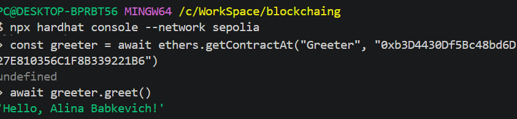

# Laboratory Work: Smart Contract Deployment on Ethereum Testnet

## 1\. Objective

To demonstrate the process of developing, compiling, and deploying Solidity smart contracts using the **Hardhat** development environment and the **Hardhat Ignition** deployment system.

-----

## 2\. Tech Stack

  * **Language:** Solidity `0.8.28`
  * **Framework:** Hardhat
  * **Network:** Ethereum Sepolia (Testnet)
  * **Tools:**
      * `dotenv`: For secure environment variable management.
      * `ethers.js`: For blockchain interaction and contract abstraction.
      * `Hardhat Ignition`: For declarative deployment orchestration.
      * `Public RPC Node`: As the network provider (Ethereum Sepolia).

-----

## 3\. Implemented Contracts

### `Greeter.sol`

**Description:** A contract that accepts a string (name) via the constructor during deployment and stores it in the blockchain state.
**Key Features:**

  * `constructor(string memory _name)`: Concatenates "Hello, " with the provided name.
  * `greet()`: A `view` function that returns the stored greeting message.
    **Purpose:** Demonstrating constructor arguments and state persistence.

### `Lock.sol`

**Description:** A time-locked vault contract that holds funds until a specific future timestamp.
**Purpose:** Demonstrating interaction with global variables like `block.timestamp` and handling Ether transfers.

-----

## 4\. Security & Best Practices

To follow industry standards for Web3 development, the following security measures were implemented:

1.  **Environment Variables:** A `.env` file was used to store the `PRIVATE_KEY`, ensuring sensitive data is not hardcoded.
2.  **Git Protection:** The `.env` file was added to `.gitignore` to prevent private keys from being leaked to version control systems.
3.  **Config Isolation:** `hardhat.config.js` retrieves credentials dynamically using `process.env`.

-----

## 5\. Deployment Results

The contracts were successfully deployed to the **Sepolia Testnet** using Hardhat Ignition.

https://sepolia.etherscan.io/tx/0x06c02f708a274891d0b177a513a671dc99351376269c339a72511cd17a5bbe74

https://sepolia.etherscan.io/tx/0x453b8efce94cbb42484b81990659ce5f11362a19ef32fe13e7a1de94cb381cde
-----

## 6\. Contract Interaction

Verification was performed via the Hardhat Console to ensure the `greet()` function returns the expected value.

**Interaction Commands:**

```javascript
const greeter = await ethers.getContractAt("Greeter", "0xb3D4430Df5Bc48bd6D27E810356C1F8B339221B6");
await greeter.greet();
```

**Output Result:**
`'Hello, Alina Babkevich!'`


-----

## 7\. Conclusion

The deployment process successfully verified the integration between the local development environment and the Ethereum Sepolia network. The use of Hardhat Ignition allowed for a reliable and resumable deployment workflow. The contract is fully functional and accessible on-chain for further interaction.